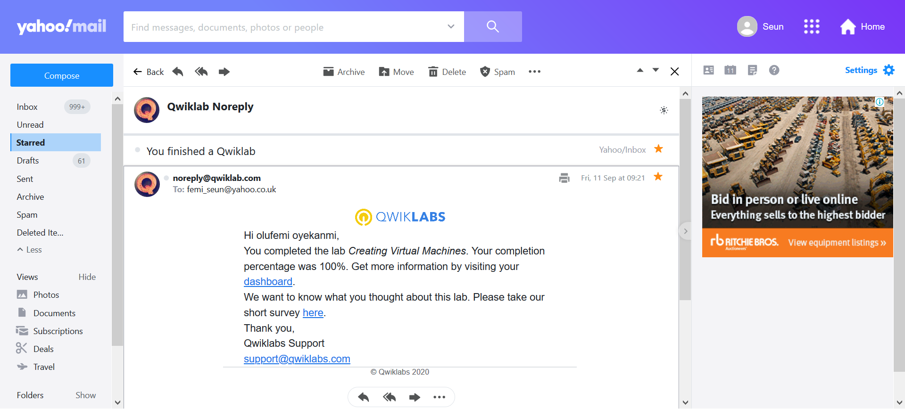
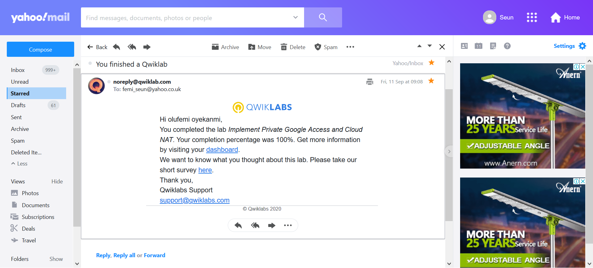
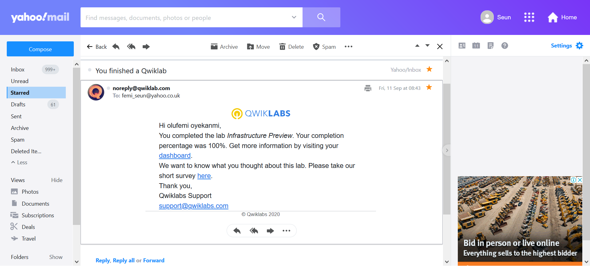
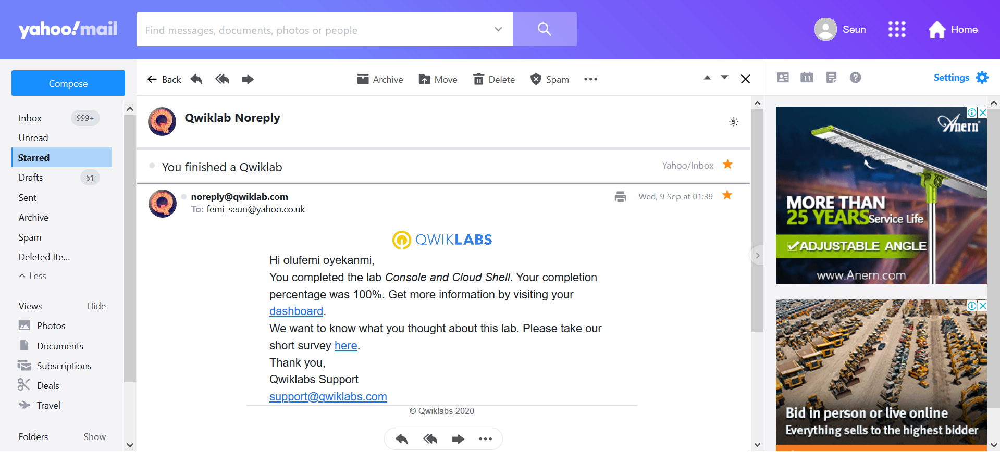
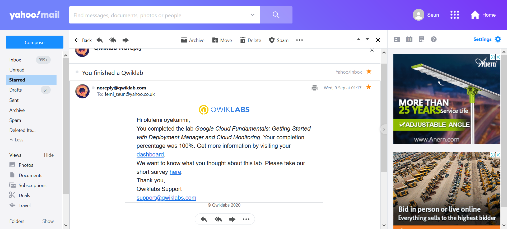
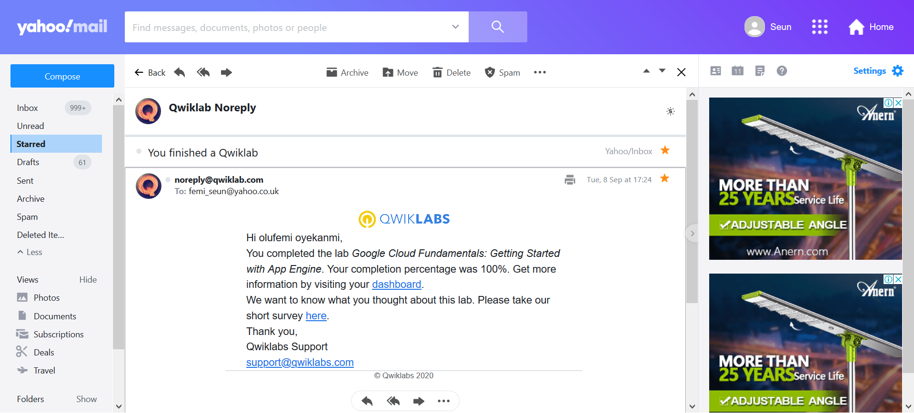
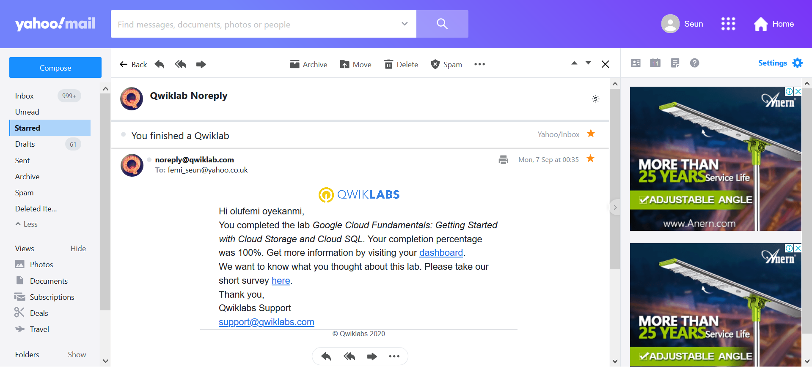
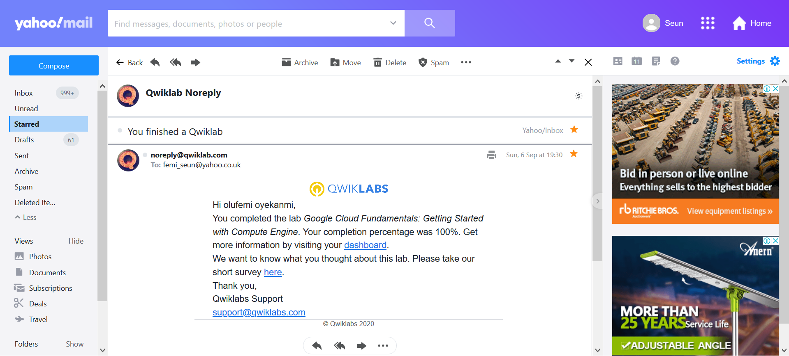
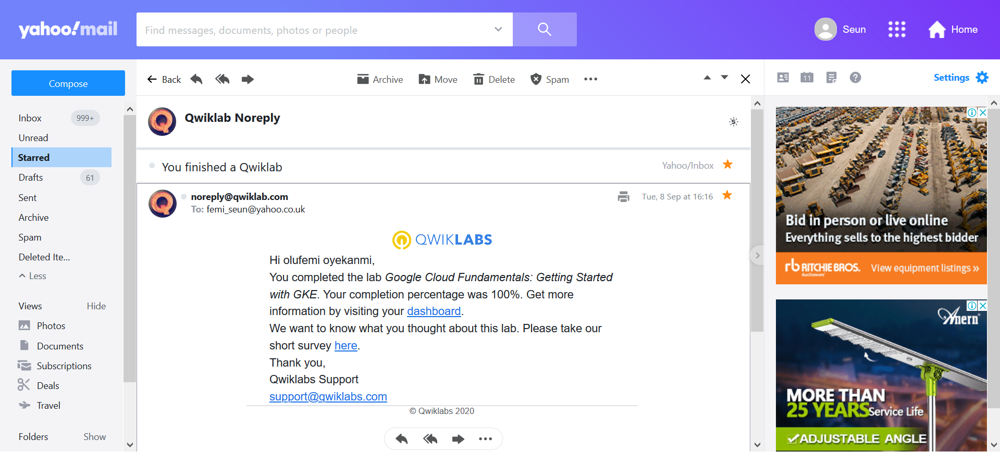

# gads-2020-project
Documentation for my GADS 2020 project.

# QwikLabs Completed
A list of labs completed.

  
Working with Virtual Machines

  

  
Creating Virtual Machines

  

  
Implement Private Google Access and Cloud NAT

  

  
Infrastructure Preview

  

  
Console and Cloud Shell

  

  
Google Cloud Fundamentals: Getting Started with Deployment Manager and Cloud Monitoring

  

  
Google Cloud Fundamentals: Getting Started with App Engine.

  

  
Google Cloud Fundamentals: Getting Started with Cloud Storage and Cloud SQL

  

  
Google Cloud Fundamentals: Getting Started with Compute Engine

  

  
Google Cloud Fundamentals: Getting Started with GKE

  

# Translation Code

  
Google Cloud Fundamentals -  Getting Started App Engine 

  

